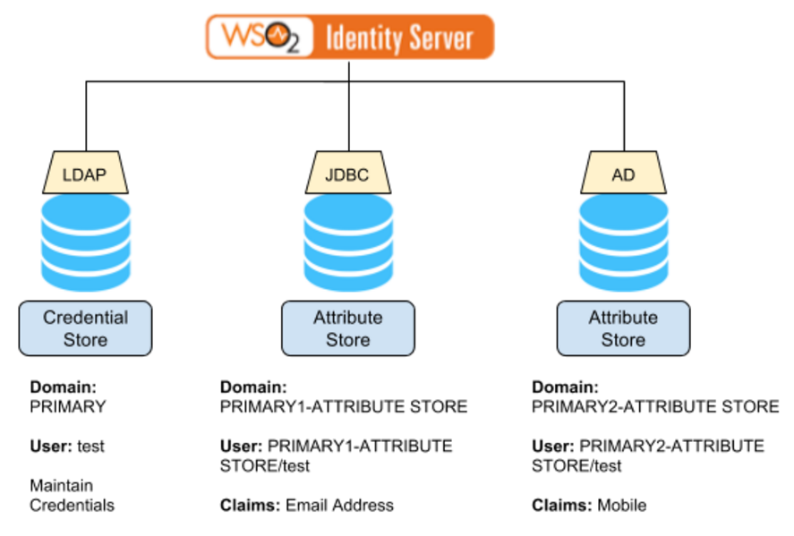

# iam-attribute-store-extension

### Custom User Management Attribute Store Extension for:
WSO2 Identity Server 5.4.0

https://wso2.com/identity-and-access-management

### Problem:

 - User credentials are maintained in a one user store while user attributes are maintained in multiple sources.
 - When the user logs into the system via any SSO protocol (SAML 2.0, ODIC, WS-Federation), build the response with user attributes coming from multiple sources.

### Solution

 - Mount the credential store and all the attribute stores as user stores to the WSO2 Identity Server. Follow a naming convention while naming the user stores where the attributes store can be differentiated from the credentials stores just by looking at the user store domain name.
 - Build a custom user store manager (extending the current user store manager corresponding to the type of the primary user store), which is aware of all the attribute stores in the system and override the method, which returns user attributes. The overridden method will iterate through the attribute stores find the user’s attributes and will return back the aggregated result.

The following diagram illustrates the solution

